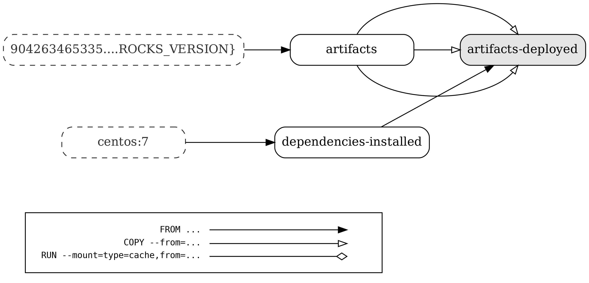

# Docker file for building all in one starrocks runtime container image.
This Docker file builds starrocks FE and BE binaries and deploy it to a locally running docker container.

## Build docker image with a new starrocks release

### Build image
```
> DOCKER_BUILDKIT=1 docker build -f Dockerfile -t <tag> . 

E.g.
> DOCKER_BUILDKIT=1 docker build -f Dockerfile -t starrocks-allin1:2.4.0-rc03 . 
```

### Start container
The container can be started in two STARTMODE:
- `manual`: the default mode. will only start be, broker, but not fe. One needs to start fe manually and add be, broker to fe.
- `auto`: will start fe, be, broker and configure be & broker on fe. This option is suitable for single node cluster
```
> docker run --env STARTMODE=[auto|manual] --name <container_name> <image_name>:<tag> 

E.g
> docker run --env STARTMODE=auto --name starrocks-allin1-2.4.0-rc03 starrocks-allin1:2.4.0-rc03 
```
## Multistage Docker build graph

